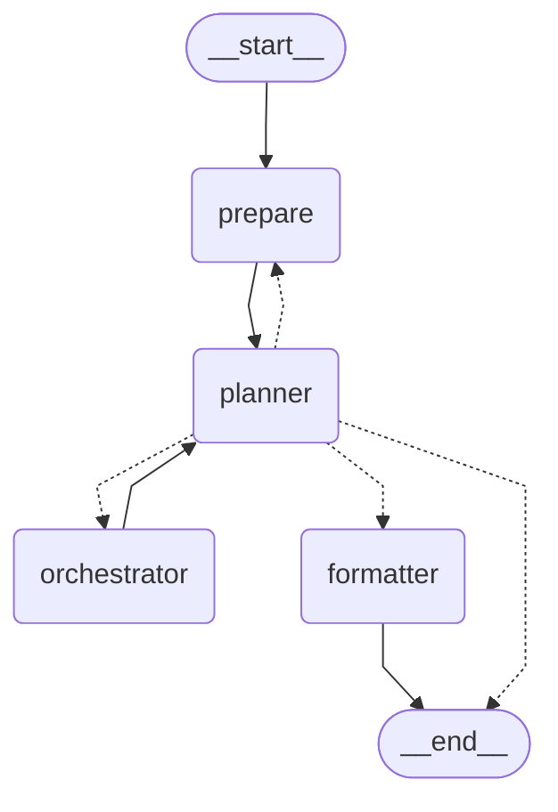

```mermaid
---
config:
  flowchart:
    curve: linear
---
graph TD;
	__start__([<p>__start__</p>]):::first
	prepare(prepare)
	planner(planner)
	orchestrator(orchestrator)
	formatter(formatter)
	__end__([<p>__end__</p>]):::last
	__start__ --> prepare;
	formatter --> __end__;
	orchestrator --> planner;
	prepare --> planner;
	planner -.-> prepare;
	planner -.-> orchestrator;
	planner -.-> formatter;
	planner -.-> __end__;
	classDef default #fad7de
	classDef first #ffdfba
	classDef last #baffc9

```